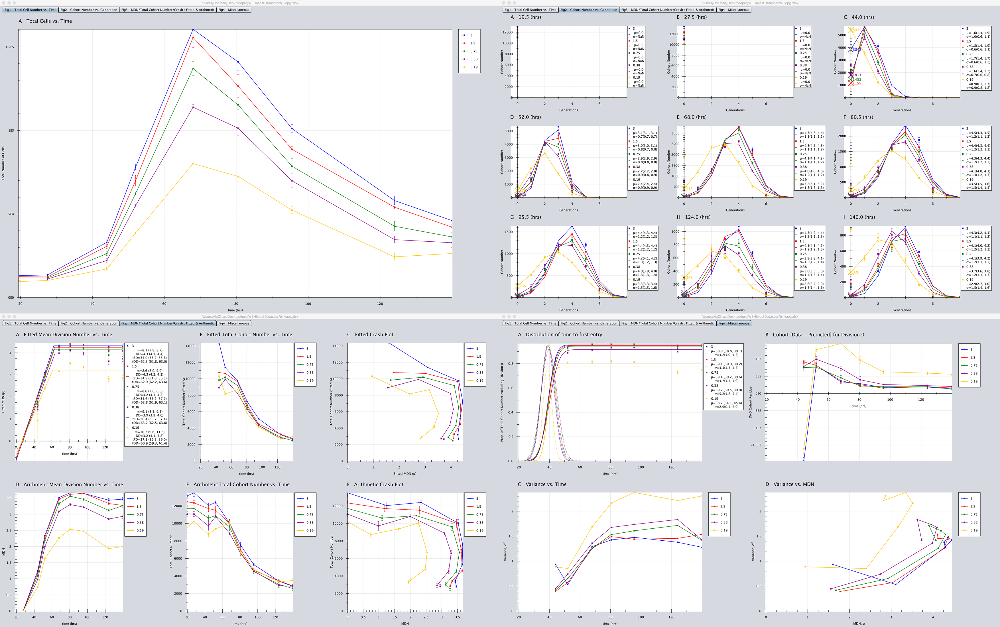
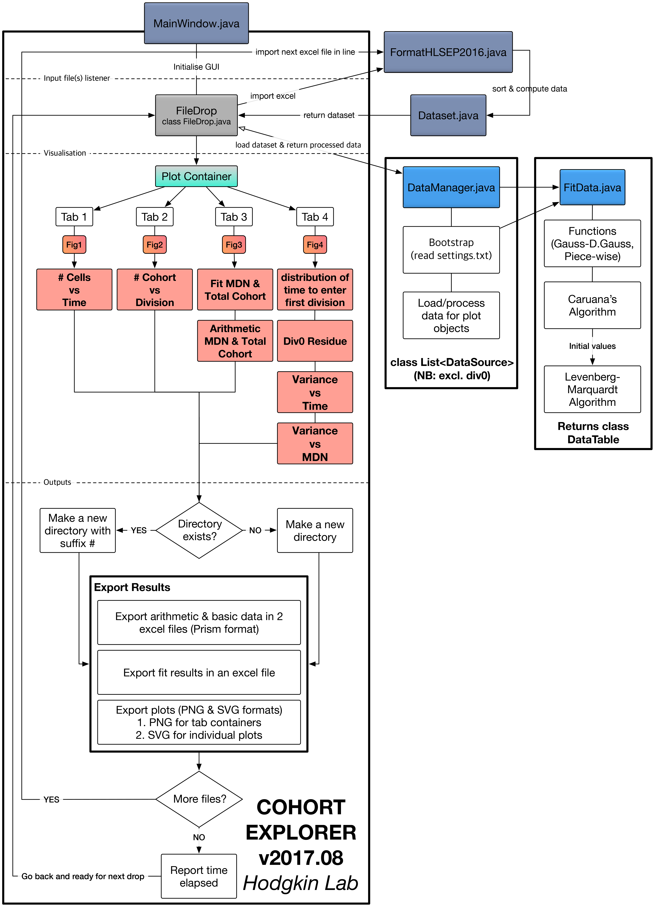

# Overview
Cohort Explorer is a standalone software that provides a quick exploration of the cell cloning dynamics through cohort analysis. It is a quantitative approach to visualise data, and lay out a basis to automatically estimate cell kinematic parameters such as division rate, time to enter first division etc. You can study basic idea of cohort method from the [poster](https://github.com/hodgkinlab/cohort-method/blob/master/documents/Kan_cohort_poster.pdf), and extensively from publications [1, 2, 3]. This document is assumed that you are familiar with fundamental principles and concepts of cohort method.

Our choice of numerical technique to estimate parameters is Levenberg-Marquardt best fit algorithm for three non-linear mathematical models with associated implicit assumptions.

> 1. Discrete Gaussian function: normality of distribution  
    Key estimation: __total cohort number__ (amplitude of distribution), __mean division number__ (&#956;), and __standard deviation__ (&#963;).
> 2. Piecewise linear function with unknown breakpoints: linear correlation & existence of plateau  
    Key estimation: __time to enter subsequent division__, __time to enter first division__, __division destiny__, and __time to enter division destiny__.
> 3. Cumulative distribution function: normality of distribution  
    Key estimation: __mean time to enter first division__.

Alternatively, the program also conducts simple arithmetic cohort operations in parallel, which endures much less assumptions than that of curve fitting method. It could be useful for datasets that are relatively far off from the models or lack of data points, and provide a secondary option to pick up insight on proliferation kinematics. Both results are conveniently collected in one plot panel so that you can easily compare two independent methods.

# Quick Start
This application was developed in [Java](https://www.java.com/) environment as such you need a Java Virtual Machine (JVM) installed in the system. Most of modern computers have it pre-installed so there is a good chance that your system already has it but ensure that latest Java is installed on the computer.

>Installation can be done by following steps:
> 1. Download the software from this [link](https://www.dropbox.com/s/vomnpogmf91sim1/cohort_explorer_v2018.05.zip?dl=0)
> 2. Extract the zip file
> 3. Open [Cohort Explorer v2017.08.jar] file
> 4. A window should pop up as shown in figure (1)
> 5. Try drag and drop example excel files included in the package

|   |   |
|:---:|:---:|
| Figure 1: Main window | Figure 2: Analysing state |
Multiple files can be dropped at once as shown in figure (2) but note that the program does not handle input files concurrently. The overall progress bar indicates percentage of completed files (out of all the input files) and the right arrow shows a current working file. The second progress bar displays the intermediate computation progress.

List of input files and each computation steps are printed to the main screen in order to provide feedbacks and aid the user to keep track of operations. Should the program encounters errors (e.g. unexpected excel format), it will skip the file and reported on the main window.

You will notice that it automatically generates *settings.txt* file if you run it for the first time. This is to set number of bootstrap iterations for calculating 95% confidence intervals on every parameter estimations. More iteration number would contribute finer parameter range, but it does not generally improve overall accuracy of the estimation itself. Keep in mind that higher iterations could result in expensive computation time, so adjust it for a good compromise between adequate report of confidence interval and speed.

# Outputs
We designed three output routines; (i) A secondary interactive window, figure (3), to collect and display all the plots at once, (ii) export three excel files that include numbers used to plot as well as estimated parameters, (iii) export individual plots in SVG and collected plots in PNG formats.

| |
|:---:|
| Figure 3: Interactive secondary panel |

All exported files can be found on newly created directory named after input data file. Meta information such as time stamps, version of the program, and settings are printed in *info.txt* for future reference. Note that output directory will not be overwritten should you run the program with same input file.

Figure numbers represent tab number in the interactive panel, and subfigures are labelled alphabetically (left to right, top to bottom in the panel) as a suffix to the figure number. Exported plots are named after their corresponding figure number and alphabets for consistency.
First tab of the panel shows evolution of the raw cell number counts for overview of the dynamics (square points: mean data ± S.E.M). If number of beads are present in your data it will calculate adjusted total cell number.

We then extract snapshots of the cell evolution, and plot them in the second tab in terms of cohort number as a function of generation. Each plot contains fitted discretised Gaussian curve with its estimated parameters displayed in respective legend (round bracket: 95% confidence interval from bootstrap). Since generation 0 often contains noisy information (e.g. unstimulated/dead cells), we excluded this from best-fit and over plotted it with extrapolated generation 0 (marked as “X”) along with the actual data.

These results are then passed on to third tab to create summary plots of parameter evolution, and perform secondary piecewise fitting in order to draw more detailed cell kinematics parameters (tab 3 plot A). Notice that this tab is mainly for comparing two different mathematical approaches in which first row is collection of fitted results from tab 2, and second row is results from independent arithmetic method.

Lastly, we fit cumulative distribution function (CDF) to ratio of sum of cohort number (excluding generation 0) to total cohort number in tab 4 plot A. This would effectively give us accumulative number of cells that are entering first generation. Therefore, it is possible to infer a distribution of average time that cells start to divide for the first time. Solid line is fitted CDF curve and dashed line is its complementary Gaussian distribution. Tab 4 plot B, C, and D are residue of extrapolated generation 0 and data, fitted variance as function of time, and variance against fitted mean division number respectively. These are information carried from tab 2, discrete Gaussian fitting results.

# Excel data format
We have adopted a custom excel format (HL-SEP-2016) in order to match output style of FlowJo, a cell proliferation assay analysis software, so that you can simply copy and paste into a new or existing excel file. In this way, we can minimise amount of manual operations to prepare data. Column A comprises of experimental setup information whereas column D to P are the main part of the cell count data. It is important to flag the excel file exactly as “HL-SEP-2016” in column B, row 1 because the program will look for this particular cell to confirm that input file is indeed in a correct format. This was implemented for future updates and backward compatibility should we introduce a new data format. An example lay out of data is shown in figure (4).

| |
|:---:|
| Figure 4: An example HL-SEP-2016 data format |

Note the order of coloured blocks for differentiating various conditions. Each time point must have row number equal to number of conditions times number of replicates in an order that you specified in list condition names. If you have a missing replicate for particular condition, then leave the row blank to flag it as an empty replicate. The program will automatically adjust calculation (e.g. average cell number) during analysis.

# Flow of computation
| |
|:---:|
| Figure 5: Cohort Explorer Flow Chart |

# References
[1] Gett A.V. and Hodgkin P.D. (2000) A cellular calculus for signal integration by T cells. Nature Immunology.

[2] Hawkins E.D. et al. (2013) Quantal and graded stimulation of B lymphocytes as alternative strategies for regulating adaptive immune responses. Nature Communications.

[3] Marchingo J.M. et al. (2014) Antigen affinity, costimulation, and cytokine inputs sum linearly to amplify T cell expansion. Science

# List of libraries
---
Third party source code
1. [Filedrop](http://iharder.sourceforge.net/current/java/filedrop/)

Extracted JAR libraries
1. [GRAL](https://github.com/eseifert/gral)
2. [VectorGraphics2D](https://github.com/eseifert/vectorgraphics2d)
3. [Efficient Java Matrix Library](http://ejml.org/wiki/index.php?title=Main_Page)
4. [Apache Commons IO](https://commons.apache.org/proper/commons-io/index.html)
5. [Apache Commons Mathematics Library](http://commons.apache.org/proper/commons-math/)
6. [Apache Commons Lang](https://commons.apache.org/proper/commons-lang/)
7. [Apache Commons Collections](https://commons.apache.org/proper/commons-collections/)
8. [Apache POI](https://poi.apache.org/)
9. [Apache XMLBeans](https://xmlbeans.apache.org/index.html)

# Released under...
---
1. Filedrop - Released in Public Domain
2. GRAL - [​GNU Lesser General Public License (LGPL v3)](http://www.gnu.org/licenses/lgpl-3.0.html)
3. VectorGraphics2D - [GNU Lesser General Public License (LGPL v3)](http://www.gnu.org/licenses/lgpl-3.0.html)
4. EJML - [Apache v2.0 license](https://www.apache.org/licenses/LICENSE-2.0)
5. All Apache libraries are released under [Apache v2.0 license](https://www.apache.org/licenses/LICENSE-2.0). List of Apache libraries - [apacheGit](http://git.apache.org/)

---

[//]: # (# TODOs)

[//]: # (## 8-Aug-2017)

[//]: # (---)

[//]: # (Core Features)

[//]: # (1. ~~Add estimation of distribution for time to first division as Figure 4D~~)

[//]: # (2. ~~Read the number of bootstrap iterations form a text file~~)

[//]: # (3. Implement a proper handling of mean division number without cells in generation zero)

[//]: # (4. Fit arithmetic plots &#40;e.g. same piece-wise fit for death time&#41;?)

[//]: # ()
[//]: # (UX Features)

[//]: # (1. ~~Print first time point for excel outputs specifically in Mean Division Number tab~~)

[//]: # (2. ~~Error handling & report to main window to provide a "guide"~~)

[//]: # (3. Domain zoom in feature [box zoom in])

[//]: # (4. Keep it simple : "prop. beads gated" removed or keep?)

[//]: # (5. Better plot export formats)

[//]: # (6. Option to choose axis range &#40;individually&#41;)

[//]: # (7. Option to change axis scale &#40;e.g. logarithmic&#41;)

[//]: # (8. Option to set different colour scheme)
